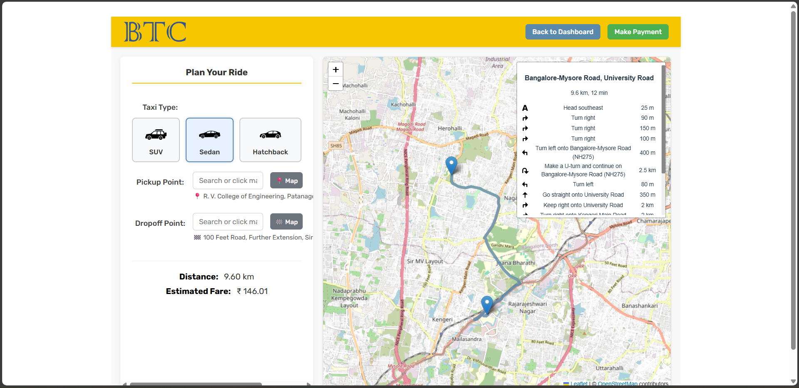

# BTC - Online Taxi Management System

Welcome to the BTC (Bengaluru Taxi Company) application, a comprehensive full-stack web project designed to simulate a modern online taxi booking and management platform. This application provides a robust suite of tools tailored for three distinct user roles: **Customers**, **Drivers**, and **Administrators**.


---

## Table of Contents
- [Core Features](#core-features)
- [Tech Stack](#tech-stack)
- [Key Functionality Walkthrough](#key-functionality-walkthrough)
  - [Customer Flow](#customer-flow)
  - [Driver Flow](#driver-flow)
  - [Admin Flow](#admin-flow)
- [Database Design](#database-design)
- [Project Setup](#project-setup)
  - [Prerequisites](#prerequisites)
  - [Backend Setup](#backend-setup)
  - [Frontend Setup](#frontend-setup)

---

## Core Features

-   **Role-Based Access:** Dedicated dashboards and functionalities for Customers, Drivers, and Admins with distinct permissions.
-   **Interactive Ride Booking:** Customers can book rides using a text-based search with suggestions or by clicking directly on an interactive map.
-   **Dynamic Routing & Fare Calculation:** Real-time route display, distance calculation, and fare estimation powered by Leaflet and OSRM.
-   **Ride Verification System:** A secure 6-digit alphanumeric code is generated for each ride, ensuring the correct customer and driver are paired upon ride completion.
-   **Driver Management:** Admins can manage the lifecycle of drivers, including adding, editing, deactivating (soft-deleting), and reactivating accounts with proper validation checks (e.g., preventing deactivation of a driver with an ongoing ride).
-   **Vehicle Management:** Admins can add new vehicles and permanently delete unassigned vehicles from the fleet.
-   **Performance Analytics:** Both drivers and admins have access to performance dashboards with daily stats and trend graphs filterable by different time periods, visualized with interactive charts.
-   **Data Integrity:** The system uses a normalized relational database (BCNF) with triggers and application-level logic to maintain data consistency and enforce business rules.

---

## Tech Stack

| Category      | Technology / Library                                                              |
|---------------|-----------------------------------------------------------------------------------|
| **Frontend**  | React, Vite, React Router DOM, Leaflet, React Leaflet, Leaflet Routing Machine, Recharts, `react-icons`, CSS3 |
| **Backend**   | Node.js, Express.js                                                               |
| **Database**  | MySQL 8.0, Stored Functions & Triggers                                            |
| **API**       | RESTful Principles, JSON                                                          |
| **Node.js Libs** | `mysql2`, `cors`, `dotenv`, `crypto`                                              |

---

## Key Functionality Walkthrough

### Customer Flow

The customer journey is designed for ease of use, from booking to rating a ride.

1.  **Login & Dashboard:** Customers log in to a personalized dashboard showing their details and a list of current, pending, or unrated rides. The crucial ride verification code is displayed here for active rides.
    *Image of Customer Dashboard*
    

2.  **Booking a Ride:** The booking page features an interactive map. Users can select pickup/dropoff locations via a search bar (with suggestions bounded to Bengaluru) or by clicking directly on the map. They can also choose their preferred vehicle type with visual icons.
    *Image of Booking Map*
    

3.  **Ride History & Editing:** Customers can view a sortable and filterable history of their completed rides and edit their account details, including their password with a visibility toggle.
    *Image of Ride History & Edit Account*
    
    

### Driver Flow

The driver's interface is focused on managing ride requests and tracking performance.

1.  **Dashboard & Ride Requests:** Upon logging in, drivers see their details, assigned vehicle, and a list of available ride requests that match their vehicle type. They can only accept a new ride if they do not currently have one in progress.
    *Image of Driver Dashboard*
    

2.  **Accepting & Completing Rides:** Drivers can view the route on a map before accepting. To complete a ride, they must enter the unique 6-digit verification code provided by the customer into a modal.
    *Image of Ride Verification Modal*
    

3.  **Performance Tracking:** Drivers have access to a dedicated performance page with daily statistics and interactive graphs showing trends in rides, commission, and ratings over time.
    *Image of Driver Performance Page*
    

### Admin Flow

The admin has full oversight of the system's core operational components.

1.  **Driver Management:** The main admin task is managing the driver roster. This page provides a sortable, searchable list of all drivers, showing their status and assigned vehicle.
    *Image of Driver Management Table*
    

2.  **Driver & Vehicle Actions:** Admins can add new drivers or vehicles through modals. They can edit active drivers, deactivate drivers (which unassigns their vehicle), reactivate them (requiring a new vehicle assignment), and delete unassigned vehicles.
    *Image of Add Driver and Add Vehicle Modals*
    
    

3.  **Company-Wide Analysis:** Admins can view an analysis page that aggregates data across the entire system, showing total rides, payments, company income, and average ratings in daily stats and trend graphs.
    *Image of Company Analysis Page*
    

---

## Database Design

The system utilizes a MySQL database with a schema normalized to BCNF to ensure data integrity and minimize redundancy. Key tables include `Customer`, `Driver`, `Admin`, `Vehicle`, `Ride`, `Payment`, `Commission`, and `Rating`. Database-level logic is implemented using Stored Functions (for fare/commission calculation) and Triggers (for enforcing valid ride status transitions).

---

## Project Setup

Follow these instructions to get a copy of the project up and running on your local machine.

### Prerequisites

-   [Node.js](https://nodejs.org/) (v16 or later)
-   [MySQL Server](https://dev.mysql.com/downloads/mysql/) (v8.0 or later)
-   A code editor like [VS Code](https://code.visualstudio.com/)
-   A Git client

### Backend Setup

1.  **Navigate to the backend directory**
    ```bash
    cd backend
    ```
2.  **Install NPM packages**
    ```bash
    npm install
    ```
3.  **Setup Database**
    -   Ensure your MySQL server is running.
    -   Create the database: `CREATE DATABASE TaxiDB;`
    -   Import the database schema and sample data by running the `taxidb_full_dump.sql` file provided in the repository.
4.  **Setup Environment Variables**
    -   Create a `.env` file in the `backend` directory by copying `.env.example`.
    -   Update the `.env` file with your MySQL username and password.
5.  **Run the Backend Server**
    ```bash
    npm run dev
    ```
    The backend server will run on `http://localhost:5001`.

### Frontend Setup

1.  **Open a new terminal window.**
2.  **Navigate to the frontend directory**
    ```bash
    cd frontend
    ```
3.  **Install NPM packages**
    ```bash
    npm install
    ```
4.  **Run the Frontend Development Server**
    ```bash
    npm run dev
    ```
    Open [http://localhost:5173](http://localhost:5173) in your browser.

---